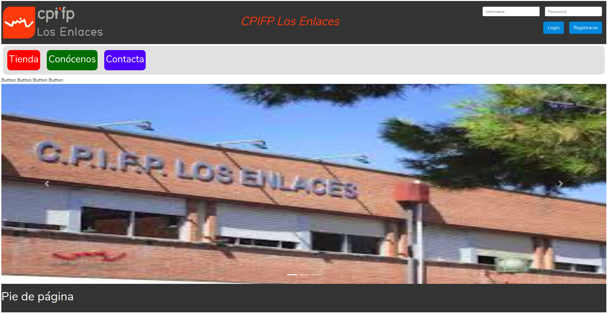
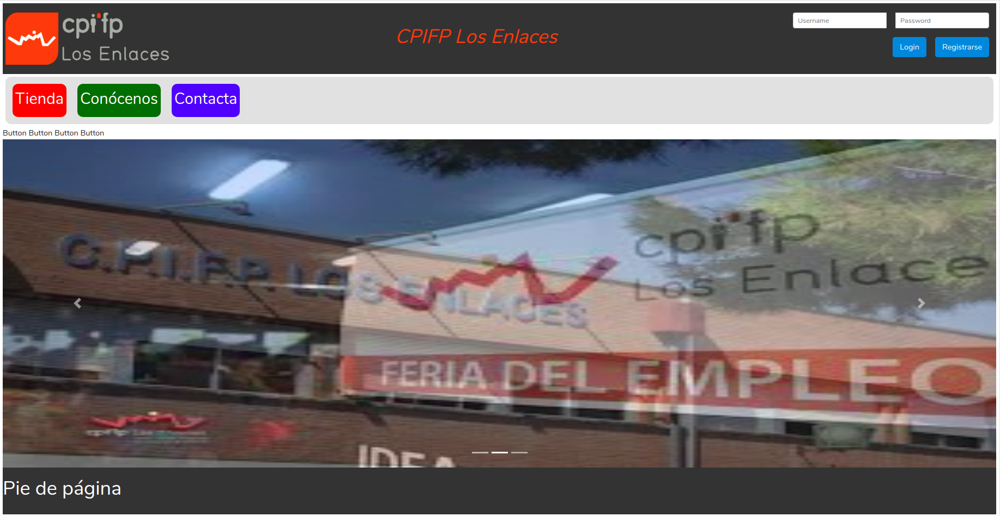

# Contenido principal
Esta va a ser una sección que va a tener mucho dinamismo en lo que es nuestra aplicación.

Para ello en la plantilla, crearemos una sección, que iremos completando en cada página, según corresponda.

En la página principal pondremos un carrusell, sacado de una plantilla de bootstrap.
Para ello buscamos tres imágenes en internet que serán nuestras tres pantallas en el carrusell. Haremos que tengan el alto y ancho de esta sección

En la  plantilla principal, agregaremos

<code>

    <!-- En la sección header del html -->
    
    
    
    <!-- ...   -->
     <main>
            @yield("contenido")
        </main>
</code>    

Entonces creamos un nuevo fichero __blade__ con el código mostrado a continuación.
<code>

    @extends(".layouts.layout_main_5");
    
    @section("contenido")
        

            <ol class="carousel-indicators">
                <li data-target="#carouselExampleIndicators" data-slide-to="0" class="active"></li>
                <li data-target="#carouselExampleIndicators" data-slide-to="1"></li>
                <li data-target="#carouselExampleIndicators" data-slide-to="2"></li>
            </ol>
            

                

                    
                

                

                    
                

                

                    
                

            

            <a class="carousel-control-prev" href="#carouselExampleIndicators" role="button" data-slide="prev">
                
                Previous
            </a>
            <a class="carousel-control-next" href="#carouselExampleIndicators" role="button" data-slide="next">
                
                Next
            </a>
        

    @endsection

</code>

Está pendiente  optimizar que los ficheros  __js__ necesarios para el carrusell,  solo se carguen si cargo los carruseles.
Por otro lado está pendiente usar solo __vue__, y no __jquery__; para ello tendría que cargar __bootstrap-vue__, pero tras dos intentos, no me ha funcionado y he decidido no dedicar de momento más tiempo a eso, ya que no es el objetivo de este proyecto.

Para cargar la plantilla, añadimos la siguiente entrada en las rutas, manteniendo los nombres, como solo uso bootstrap para esta sección, no hya que aportar nada de __css__

<code>

    Route::view("5main", "p5_main");
</code>

Nos qudan las siguientes pantallas

