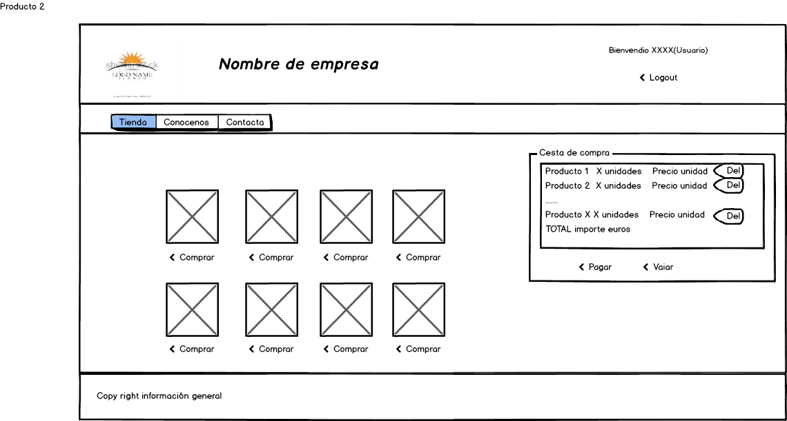
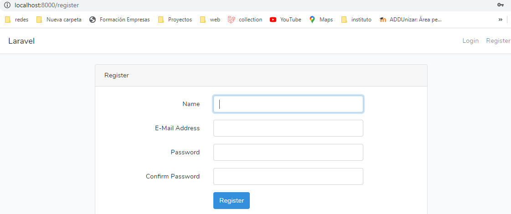

# README

 [](https://travis-ci.org/laravel/framework) [](https://packagist.org/packages/laravel/framework) [](https://packagist.org/packages/laravel/framework) [](https://packagist.org/packages/laravel/framework)

## Introducción
__LaravelTienda__ es un pequeño proyecto para adentranos en laravel.

Para ello rehacemos la práctica de la _tienda_ usando __laravel__ y vamos especificando requisitos e implementación

### Herramientas utilizadas
 * __Pick__ para seleccionar colores https://ubunlog.com/pick-selector-color-ubuntu/
 * __flex__ documentación [Guía para usar flex](https://css-tricks.com/snippets/css/a-guide-to-flexbox)
 * __dia__
 * __git__
 * __laravel__
 * __php__
 * __mysql__
 
 
## Creamos el nuevo proyecto
 ```bash
 laravel new LaravelTienda
```
#Contenido o sumary
* [Diseño de pantallas](./Doc/diseno_pantallas.md)
* [Creación de la pantallas blade]()
* [Autentificación o autenticacion]()
* [Creación de rutas]()
* [Creación de bases de datos y su población]()
* [Gestión de sesiones]()
* [Factura]()
* [Idiomas]()
* [PDF]()

### Diseño de la interfaz gráfica

Usamos balsamiq para el diseño gráfico [Cómo usar balsamiq en ubuntu](https://github.com/balsamiq/balsamiq-wireframes-linux) descargamos y ejecutamos con el siguiente comando:

 `get` [`https://raw.githubusercontent.com/balsamiq/balsamiq-wireframes-linux/master/bw.yml`](https://raw.githubusercontent.com/balsamiq/balsamiq-wireframes-linux/master/bw.yml) `-O /tmp/bw.yml && lutris -i /tmp/bw.yml`

#### Página principal


Aquí vemos una sección de cabecera, un menú, un contendio y un pie de página Si el usuario estuviera conectado sólo cambiará el menú superior 

**Página de tienda**

En esta página solo se puede acceder si se está conectado. 

**Página de imprimir**

En esta página solo se puede acceder si se está conectado. 

**Página de pagar**

En esta página solo se puede acceder si se está conectado. 

**Página contacta**

En esta página solo se puede acceder si se está conectado. 

**Página conocenos**


**Página registrarse**


### Cargar Bootstrap en el proyecto

Vamos a usar bootstrap para partes del diseño de nuestro proyecto. Bootstrap [Referencia web en la página oficial](https://laravel.com/docs/7.x/frontend) Instalamos el paquete laravel/ui bien directamente  
 `composer require laravel/ui`

O bien lo incluimos en la sección require de composer.json y volvemos a orquestar

```text

 ``//.....
 "require": {
         "php": "^7.2.5",
         "fideloper/proxy": "^4.2",
         "fruitcake/laravel-cors": "^2.0",
         "guzzlehttp/guzzle": "^6.3",
         "laravel/framework": "^7.0",
         "laravel/tinker": "^2.0",
         "laravel/ui":"^2.0" 
    },``
```

Orquestamos

 `composer update`

Ahora instalamos bootstrap en local usando artisan, para ello realizamos los siguientes pasos \(ver la página oficial para las explicaciones más detalladas\)

```text

php artisan ui bootstrap 
npm install
npm run install
```

 Una vez realizada estas acciones podemos ver que tenemos disponible en la carpeta !\[ficheros creados tras la instalación de bootstrap\]\(./storage/imagenes/mockups/bootstrap\_js.png\) Ahora para poder usar bootstrap lo único que tenemos que hacer es referenciarlo en el fichero blade \#\# Realización de las plantillas con blade En esta apartado debemos realizar las plantillas de cada una de los mockups. Para ello vamos a crear la plantilla o layout que llevarán todas las página. !\[Layout general\]\(./storage/imagenes/mockups/Layout.png\) \# Autentificación Vamos a usar la autentificación que trae laravel por defecto, luego veremos cómo modificar alguna de estos valores por defecto, como será: - Cambiar los campos de usuarios registrados - Cambiar los campos de autentificación - Camibar el diseño de formuario para login \#\#Establecer la autentificación por defecto Para ello debemos de realizar una serie de pasos muy sencillos. Primero vamos a instalar esta autentificación para instalar los controladores necesarios

```text

 php artisan ui vue --auth
```

 Tras haber ejectuado este comando hemos instalado la autentificación qeu por defecto trae Laravel. Con ello tendremos instalado: - Rutas. Si abrimos el fichero web.php observamos

```text

     Auth::routes();
     Route::get('/home', 'HomeController@index')->name('home');
```

 - Vistas de login y de registro !\[Vistras creadas para la autentificación\]\(./public/imagenes/imagenes\_apuntes/vistas\_auth.png\) - Controlador para instalarlo: \_\_HomeController.php\_\_ y directorio \_\_Auth\_\_ !\[Conroladores antes de cargar auth\]\(./public/imagenes/imagenes\_apuntes/before\_\_auth.png\) !\[Conroladores después de cargar auth\]\(./public/imagenes/imagenes\_apuntes/after\_auth.png\) \_\_Qué podemos ver que ha ocurrido ahora\_\_ Si miramos \_\_web.php\_\_ vemos que si queremos acceder a /home, primero deemos estar autentificados Si abrimos un navegador y escribimos \_\_http://localhost:8000/home, nos redirije automáticamente a una página de logín ya que no estamos logueados Este es el efecto del middleware que se ha incluido en \_\_web.php\_\_ a través del controlador HomeController

```text

     public function __construct()
      {
          $this->middleware('auth');
      }

      /**
       * Show the application dashboard.
       *
       * @return \Illuminate\Contracts\Support\Renderable
       */
      public function index()
      {
          return view('home');
      }
```

Un middleware es un software intermedio que podemos establecer que se ejecute antes o después de una determinada acción En este caso le decimos que si se solicita una página verfique antes que se esté autentificado, y si no redirigimos a la autentificación de usuario Una vez que el usuario se haya autentificado devolveremos la página solicitada, en este caso **home**


Si damos a registrar nos aparecerá el formulario siguiente



Pero esto no funcionará, ya que primero hemos de crear las tablas en la base de datos para almacenar la información Para ello, laravel ya trae preparadas unas migraciones por defecto 

Preparamos la base de datos. Para ello establecemos en al fichero de configuración **.env** la configuracion de nuestra base de datos y de cómo acceder a ella 

Y ahora ejecutamos las migraciones, para ello, la primera vez ejectuamos las migraciones

```
 php artisan migrate:install 
```

Y ahora ejectuamos las migracione que tenemos pendientes que serían las tres que vienen por defecto en laravel para usar la autentificación

```
 php artisan migrate 
```

Ahora viene cuando queremos adaptar este logín a nuestra aplicación, es decir, queremos aprovechar esta infraestructura lógica, pero cambiar básicamente los tres aspectos que hemos comentado anteriormente 1. Formulario de login 2. Campos con los que nos logueamos 3. Campos de registro \(Mantenemos este formulario\)

#### Adaptando el formulario de login

\*En este caso no vamos a tener una página con el formulario, si no que es parte de la página principal El diseño de la página principal sin loguearse es

